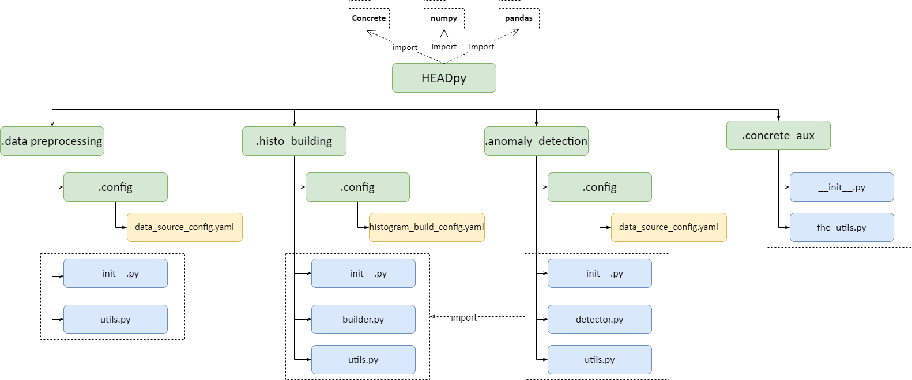
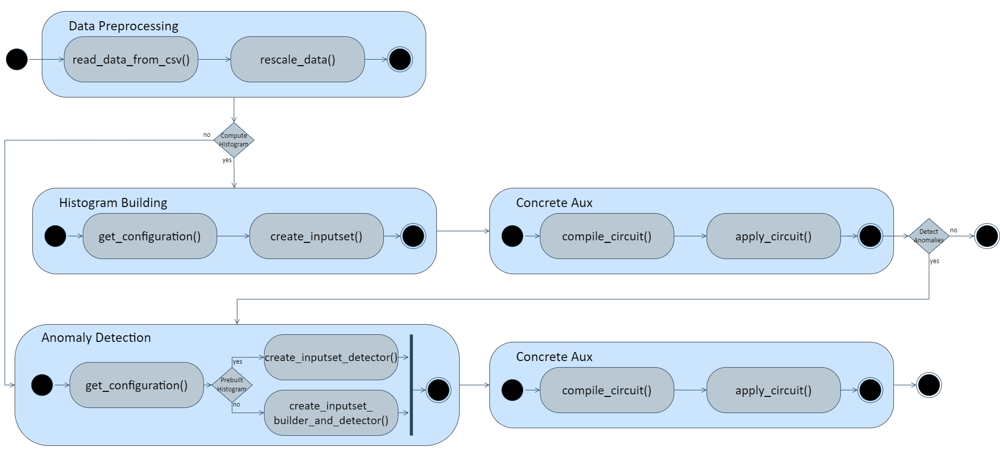

# HEADPY anomaly detection in HE IoT data library implementation

The high-level architecture of ```HEADpy```

  

```HEADpy``` consists of three packagase:
- ```data_preprocessing```: it implements tasks such as cleaning, transforming, and organizing data ([documentation](https://github.com/dragoslazea/HEADpy/blob/master/doc/data_preprocessing_doc.md));
- ```histo_building```: : it is responsible for creating both clear and cryptographic equi-width histograms ([documentation](https://github.com/dragoslazea/HEADpy/blob/master/doc/histo_building_doc.md));
- ```anomaly_detection```: it allows the user to detect anomalies in both clear and homomorphically encrypted data ([documentation](https://github.com/dragoslazea/HEADpy/blob/main/doc/anomaly_detection_doc.md));
- ```concrete_aux```: it is responsible for compiling clear functions into circuits operating on encrypted data, applying circuits on encrypted data samples, and testing if the circuits provide the same results as the original, clear function ([documentation](https://github.com/dragoslazea/HEADpy/blob/main/doc/concrete_aux_doc.md)).

The flow of activities including all use cases of our framework is depicted below:
  